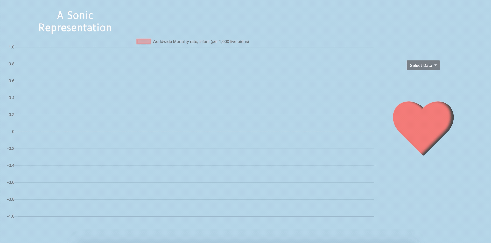

# Heart Beat

Heart Beat is a data visualization, sonification, and analysis of infant mortality rates throughout time. I created this webpage as an entry in Stanford's CS109 project competition. 

